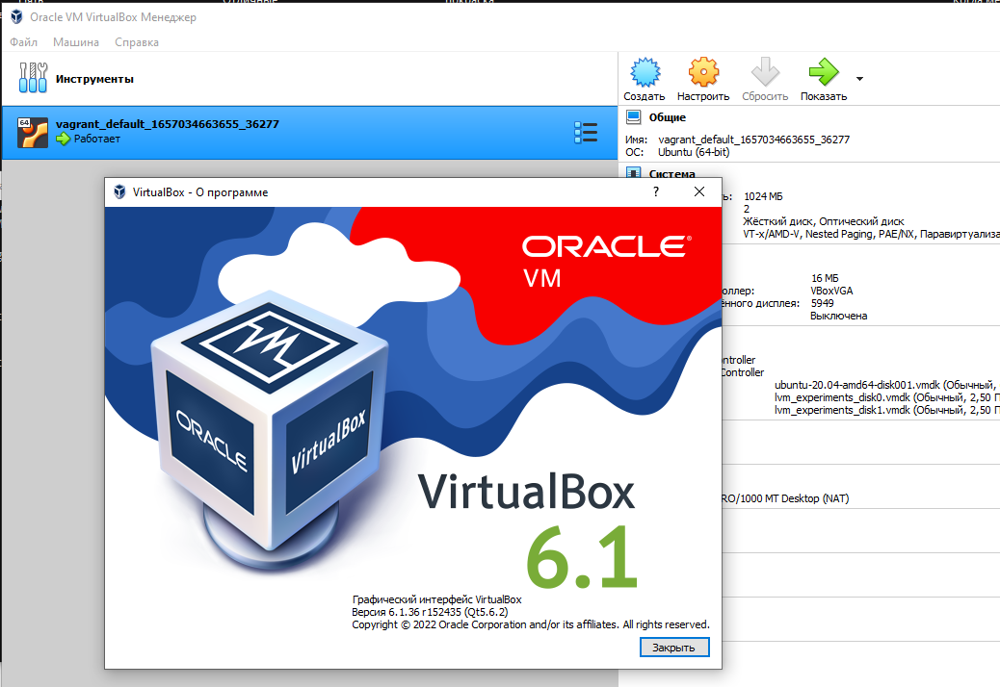
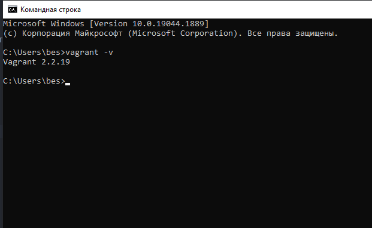

# Домашнее задание к занятию "5.2. Применение принципов IaaC в работе с виртуальными машинами"

## Задача 1
Опишите своими словами основные преимущества применения на практике IaaC паттернов.
Какой из принципов IaaC является основополагающим?

### Ответ:

        1) Методология CI/CD 
           - Ускоряет  выход минимально работоспособного программного продукта 
             в продакшен (сокращается time-to-market ). 
           - Использование методологии CI/CD позволяет командам разрабочиков часто вносить изменения в приложения 
             с надежным процессом поставки.
           - Повышает качество, позволяя отсеивать ошибки еще на этапе CI .   
           - Устраняет "дрейф конфигураций".  
          
        2) Основополагающим  принципом IaaC является создание условий для воспроизводимости окружения 
           и сохранения работоспособности программного продукта.

## Задача 2
Чем Ansible выгодно отличается от других систем управление конфигурациями?
Какой, на ваш взгляд, метод работы систем конфигурации более надёжный push или pull?

### Ответ:

        - Ansible проще в освоении. Язык плейбуков YAML максимально человекочитаем.
        - Использует, в отличие от других продуктов, сущеcтвущий "defacto" сервис sshd  
          и не требует установки PKI-окружения. 
        - Дополнительные модули можно докачать из официального репозитория налету.
        - Тысячи готовых плейбуков на портале Ansible Galaxy.
        - Легко вносить изменения в силу популярности PYTHON.
        - Есть графический интерфейс Ansible Tower, хотя и с багами.
        - Подробный ansible -h .
        - Можно использовать не только push-метод, но и pull.

        2) Более надежным является метод "pull", поскольку при использованиие метода "push"  
           нет гарантии, что вносимые изменения на целевом хосте применятся , 
           если он будет недоступен в момент исполнения  скрипта.   

## Задача 3
Установить на личный компьютер:
VirtualBox
Vagrant
Ansible
Приложить вывод команд установленных версий каждой из программ, оформленный в markdown.

---

### Ответ:

####  1. Устанавливаем  VirtualBox на  Windows 10

####  2. Устанавливаем  Hashi-Corp Vagrant на  Windows 10

#### Устанавливаем виртуальную машину c ОС Ubuntu 20.04 в гипервизоре Oracle VirtualBox 
#### с помощью cледующего файла конфигурации Vagrantfile

     ISO = "bento/ubuntu-20.04"
     NET = "192.168.192."
     DOMAIN = ".netology"
     HOST_PREFIX = "ansible"
     INVENTORY_PATH = "../ansible/inventory"
     servers = [  
       {    
         :hostname => HOST_PREFIX + DOMAIN,    
         :ip => NET + "11",    
         :ssh_host => "20011",    
         :ssh_vm => "22",    
         :ram => 1024,    
         :core => 1  
       }
     ]
     
     Vagrant.configure(2) do |config|  
         config.vm.synced_folder ".", "/vagrant", disabled: false  
         servers.each do |machine|    
         config.vm.define machine[:hostname] do |node|      
         node.vm.box = ISO      
         node.vm.hostname = machine[:hostname]      
         node.vm.network "private_network", ip: machine[:ip]      
         node.vm.network :forwarded_port, guest: machine[:ssh_vm],host: machine[:ssh_host]      
                 node.vm.provider "virtualbox" do |vb|
                     vb.customize ["modifyvm", :id, "--memory", machine[:ram]]        
                     vb.customize ["modifyvm", :id, "--cpus", machine[:core]]        
                     vb.name = machine[:hostname]      
                 end
             end  
         end
     end

---

####  Проверяем конфигурацию сервера

    $ vagrant ssh ansible.netology

    root@ansible:~# hostname
    ansible.netology
    root@ansible:~#

    root@ansible:~# cat /etc/*release
    DISTRIB_ID=Ubuntu
    DISTRIB_RELEASE=20.04
    DISTRIB_CODENAME=focal
    DISTRIB_DESCRIPTION="Ubuntu 20.04.4 LTS"
    NAME="Ubuntu"
    VERSION="20.04.4 LTS (Focal Fossa)"
    ID=ubuntu
    ID_LIKE=debian
    PRETTY_NAME="Ubuntu 20.04.4 LTS"
    VERSION_ID="20.04"
    HOME_URL="https://www.ubuntu.com/"
    SUPPORT_URL="https://help.ubuntu.com/"
    BUG_REPORT_URL="https://bugs.launchpad.net/ubuntu/"
    PRIVACY_POLICY_URL="https://www.ubuntu.com/legal/terms-and-policies/privacy-policy"
    VERSION_CODENAME=focal
    UBUNTU_CODENAME=focal
    root@vagrant:/home/vagrant#

    root@ansible:~# ip a | grep inet
        inet 127.0.0.1/8 scope host lo
        inet6 ::1/128 scope host
        inet 10.0.2.15/24 brd 10.0.2.255 scope global dynamic eth0
        inet6 fe80::a00:27ff:fea2:6bfd/64 scope link

---

#### Устанавливаем Ansible на сервере ansible.netology  c ОС Ubuntu 20.04, запущенном в  VirtualBox.

    root@ansible:~# sudo apt update
    root@ansible:~# apt-get update
    root@ansible:~# apt-get install ansible -y

    Результат :

    root@ansible:~#  ansible --version
    ansible [core 2.12.8]
      config file = /etc/ansible/ansible.cfg
      configured module search path = ['/root/.ansible/plugins/modules', '/usr/share/ansible/plugins/modules']
      ansible python module location = /usr/lib/python3/dist-packages/ansible
      ansible collection location = /root/.ansible/collections:/usr/share/ansible/collections
      executable location = /usr/bin/ansible
      python version = 3.8.10 (default, Mar 15 2022, 12:22:08) [GCC 9.4.0]
      jinja version = 2.10.1
      libyaml = True
    root@ansible:~# 

--- 

## Задача 4 (*)

Воспроизвести практическую часть лекции самостоятельно.
Создать виртуальную машину.
Зайти внутрь ВМ, убедиться, что Docker установлен с помощью команды
docker ps

---

### Ответ:

#### Развертываем  пакеты Ansible и Vagrant на нашей рабочей станции EDWARD
#### В качестве пользователя указываем  vagrant  c паролем vagrant
 
#### Устанавливаем Ansible      
     root@EDWARD:~# sudo apt update
     root@EDWARD:~# apt-get update
     root@EDWARD:~# apt-get install ansible -y

#### Проверяем результат

     root@EDWARD:~# ansible --version
     ansible 2.10.8
       config file = None
       configured module search path = ['/root/.ansible/plugins/modules', '/usr/share/ansible/plugins/modules']
       ansible python module location = /usr/lib/python3/dist-packages/ansible
       executable location = /usr/bin/ansible
       python version = 3.10.4 (main, Jun 29 2022, 12:14:53) [GCC 11.2.0]
     root@EDWARD:~#

#### Создаем файл inventory - списка хостов

        root@EDWARD:/etc/ansible# cat /etc/ansible/inventory

        [nodes:children]
        manager
        
        [manager]
        docker1.netology ansible_host=192.168.56.11 ansible_port=22 ansible_user=vagrant ansible_password=vagrant

        [all:vars]
        ansible_python_interpreter=/usr/bin/python3

#### Правим файл конфигурации ansible.cfg, указывая на созданный выше файл inventory
       
       root@EDWARD:/etc/ansible# cat /etc/ansible/ansible.cfg
        [defaults]
        
        inventory=./inventory
        deprecation_warnings=False
        command_warnings=False
        ansible_port=22
        interpreter_python=/usr/bin/python3

#### Проверяем корректность конфигурации хостов, перечисленных в файле inventory

       root@EDWARD:/etc/ansible# ansible-inventory --list -y
       all:
         children:
           nodes:
             children:
               manager:
                 hosts:
                   docker1.netology:
                     ansible_host: 192.168.56.11
                     ansible_password: vagrant
                     ansible_port: 22
                     ansible_python_interpreter: /usr/bin/python3
                     ansible_user: vagrant
           ungrouped: {}
       root@EDWARD:/etc/ansible#

#### Устанавливаем программу для запуска процесса ssh неинтерактивно

        root@EDWARD:/etc/ansible# apt install sshpass
#### Устанавливаем VirtualBox
    
     root@EDWARD:~# sudo apt update && sudo apt install virtualbox

#### Устанавливаем Vagrant
    
     root@EDWARD:~# sudo apt update && sudo apt install vagrant

#### Проверяем результат

     root@EDWARD:~# vagrant --version
     Vagrant 2.2.19
     root@EDWARD:~#      

####  Скачиваем файл образа  вручную

     root@EDWARD:/etc/vagrant#  curl -L -o /etc/vagrant/boxes/focal-ubuntu-20.04.box  https://app.vagrantup.com/ubuntu/boxes/focal64/versions/20220825.0.0/providers/virtualbox.box

####  Добавляем образ в репозиторий

     root@EDWARD:/etc/vagrant#  vagrant box add focal/ubuntu-20.04 /etc/vagrant/boxes/focal-ubuntu-20.04.box

#### Переходим в папку /etc/vagrant и выполняем команду инициализации

     root@EDWARD:/etc/vagrant#  vagrant init focal/ubuntu-20.04

     A `Vagrantfile` has been placed in this directory. You are now
     ready to `vagrant up` your first virtual environment! Please read
     the comments in the Vagrantfile as well as documentation on
     `vagrantup.com` for more information on using Vagrant.
     root@EDWARD:/etc/vagrant

#### Помещаем в папку /etc/vagrant следующий конфигурационный файл Vagrantfile  : 

 <https://github.com/edward-burlakov/vagrant/blob/main/Vagrantfile>

  
 #### Запускаем виртуальный сервер docker1.netology

---
      root@EDWARD:/~# vagrant up
        Bringing machine 'docker1.netology' up with 'virtualbox' provider...
        Bringing machine 'docker2.netology' up with 'virtualbox' provider...
        ==> docker1.netology: Importing base box 'bento/ubuntu-20.04'...
        ==> docker1.netology: Matching MAC address for NAT networking...
        ==> docker1.netology: Checking if box 'bento/ubuntu-20.04' version '202206.03.0' is up to date...
        ==> docker1.netology: Setting the name of the VM: docker1.netology
        ==> docker1.netology: Clearing any previously set network interfaces...
        ==> docker1.netology: Preparing network interfaces based on configuration...
            docker1.netology: Adapter 1: nat
            docker1.netology: Adapter 2: hostonly
        ==> docker1.netology: Forwarding ports...
            docker1.netology: 22 (guest) => 2222 (host) (adapter 1)
        ==> docker1.netology: Running 'pre-boot' VM customizations...
        ==> docker1.netology: Booting VM...
        ==> docker1.netology: Waiting for machine to boot. This may take a few minutes...
            docker1.netology: SSH address: 127.0.0.1:2222
            docker1.netology: SSH username: vagrant
            docker1.netology: SSH auth method: private key
            docker1.netology: Warning: Connection reset. Retrying...
            docker1.netology: Warning: Connection aborted. Retrying...
            docker1.netology:
            docker1.netology: Vagrant insecure key detected. Vagrant will automatically replace
            docker1.netology: this with a newly generated keypair for better security.
            docker1.netology:
            docker1.netology: Inserting generated public key within guest...
            docker1.netology: Removing insecure key from the guest if it's present...
            docker1.netology: Key inserted! Disconnecting and reconnecting using new SSH key...
        ==> docker1.netology: Machine booted and ready!
        ==> docker1.netology: Checking for guest additions in VM...
        ==> docker1.netology: Setting hostname...
        ==> docker1.netology: Configuring and enabling network interfaces...

####  переходим в рабочий каталог vagrant, входим на гостевой сервер  и проверяем версию ОС сервера: 
      root@EDWARD:/~# cd /etc/vagrant
      root@EDWARD:/etc/vagrant#  vagrant ssh docker1.netology

      vagrant@docker1:~$ sudo su
      root@docker1:/home/vagrant# cat /etc/*release | grep VERSION
      VERSION="20.04.5 LTS (Focal Fossa)"
      VERSION_ID="20.04"
      VERSION_CODENAME=focal
      root@docker1:/home/vagrant#

####  Проверяем имя сервера и наличие сетевых интерфейсов.
      
       root@docker1:/home/vagrant# hostname -f
       docker1.netology
       root@docker1:/home/vagrant#

       root@docker1:/home/vagrant# ip a | grep inet | grep 192
         inet 192.168.56.11/24 brd 192.168.192.255 scope global eth1
       root@docker1:/home/vagrant#

####  Добавляем на удаленном сервере в  возможность авторизации по паролю
      root@docker1:/home/vagrant#  tail -n 3 /etc/ssh/sshd_config
        PasswordAuthentication yes
        PermitRootLogin no
        PubkeyAuthentication yes

#### Выходим из гостевого сервера

      root@docker1:/home/vagrant# exit
      exit
      vagrant@docker1:~$ exit
      logout
      root@EDWARD:/etc/vagrant#

#### Генерим локальные ssh-ключи

    root@EDWARD:/etc/ansible# ssh-keygen
    Generating public/private rsa key pair.
    Enter file in which to save the key (/root/.ssh/id_rsa):
    Enter passphrase (empty for no passphrase):
    Enter same passphrase again:
    Your identification has been saved in /root/.ssh/id_rsa
    Your public key has been saved in /root/.ssh/id_rsa.pub

#### Добавляем ssh-ключи на удаленный сервер

    root@EDWARD:~#  ssh-copy-id -i ~/.ssh/id_rsa.pub -p 22 vagrant@192.168.56.11
  
    /usr/bin/ssh-copy-id: INFO: Source of key(s) to be installed: "/root/.ssh/id_rsa.pub"
    /usr/bin/ssh-copy-id: INFO: attempting to log in with the new key(s), to filter out any that are already installed
    /usr/bin/ssh-copy-id: INFO: 1 key(s) remain to be installed -- if you are prompted now it is to install the new keys
    vagrant@192.168.56.11's password:

    Number of key(s) added: 1

    Now try logging into the machine, with:   "ssh -p '22' 'vagrant@192.168.56.11'"
    and check to make sure that only the key(s) you wanted were added.

#### Подключаемся в первый раз по ssh и получаем удаленные ключи локально. 
     root@EDWARD:~#  ssh 192.168.56.11 -l vagrant
      
#### Проверяем подключение Ansible к docker1.netology с помощью запуска на удаленном сервере модуля ping  

      root@EDWARD:/etc/ansible# ansible docker1.netology -m ping 
      SSH password:
      docker | SUCCESS => {
          "changed": false,
          "ping": "pong"
      }
      root@EDWARD:/etc/ansible#

####  Создаем файл плейбука provision.yml в каталоге /etc/ansible

       ---  

         — hosts: nodes    
           become: yes    
           become_user: root    
           remote_user: vagrant    
         
           tasks:      
             — name: Create directory for ssh-keys        
               file: state=directory  mode=0700   dest=/root/.ssh/
       
             — name: Adding rsa-key in /root/.ssh/authorized_keys        
               copy: src=~/.ssh/id_rsa.pub dest=/root/.ssh/authorized_keys  owner=root mode=0600        
               ignore_errors: yes
       
             — name: Checking DNS        
               command: host -t A google.com

             — name: Installing tools        
               apt: >
                 package={{ item }}          
                 state=present
                 update_cache=yes        
               with_items:
                 — git          
                 — curl

             — name: Installing docker        
               shell: curl -fsSL get.docker.com -o get-docker.sh && chmod +x get-docker.sh && ./get-docker.sh      

             — name: Add the current user to docker group        
               user: name=vagrant append=yes groups=docker

####  Создаем логическую ссылку на файл inventory в HOME-каталоге пользователя root

       root@EDWARD:~# ln -s /etc/ansible/inventory inventory
       root@EDWARD:~# ls -la | grep inventory
       lrwxrwxrwx 1 root    root      22 Aug 28 03:43 inventory -> /etc/ansible/inventory

####  Подключаем Ansible playbook к нашей Vagrant конфигурации - добавляем записи в файл Vagrantfile:

      INVENTORY_PATH = "../ansible/inventory"

      node.vm.provision "ansible" do |setup| 
        setup.inventory_path = INVENTORY_PATH 
        setup.playbook = "../ansible/provision.yml" 
        setup.become = true setup.extra_vars = { ansible_user: 'vagrant' }
      end

####  Изменяем конфигурацию сервер docker1.netology, устанавливая пакет docker

      root@EDWARD:~# cd /etc/vagrant
      root@EDWARD:/etc/vagrant# vagrant up docker1.netology --provision

 1Help      2Save      3Mark      4Replac    5Copy      6Move      7Search    8Delete    9PullDn   10Quit
