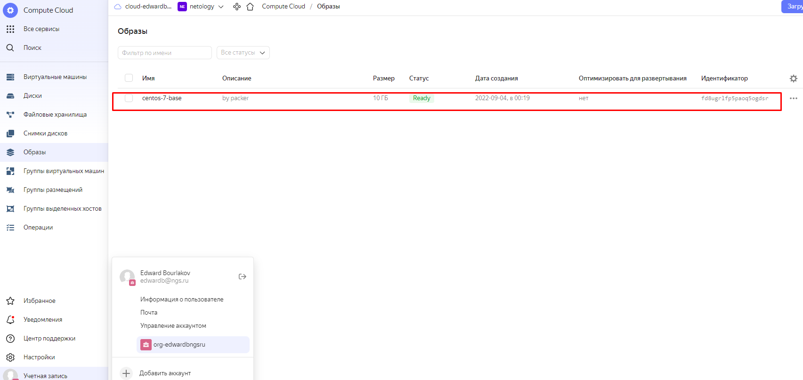
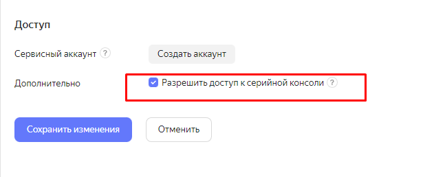
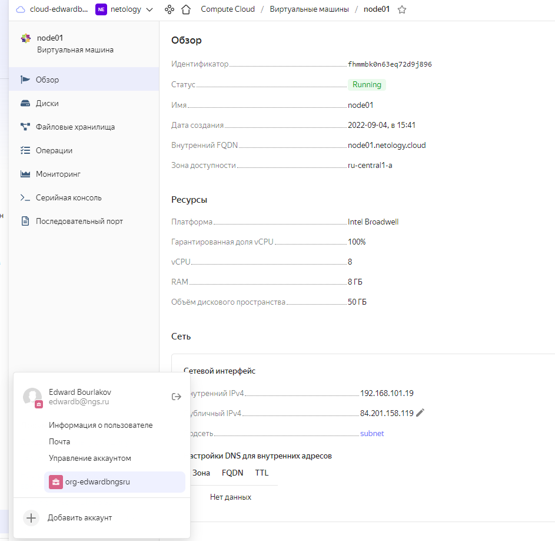
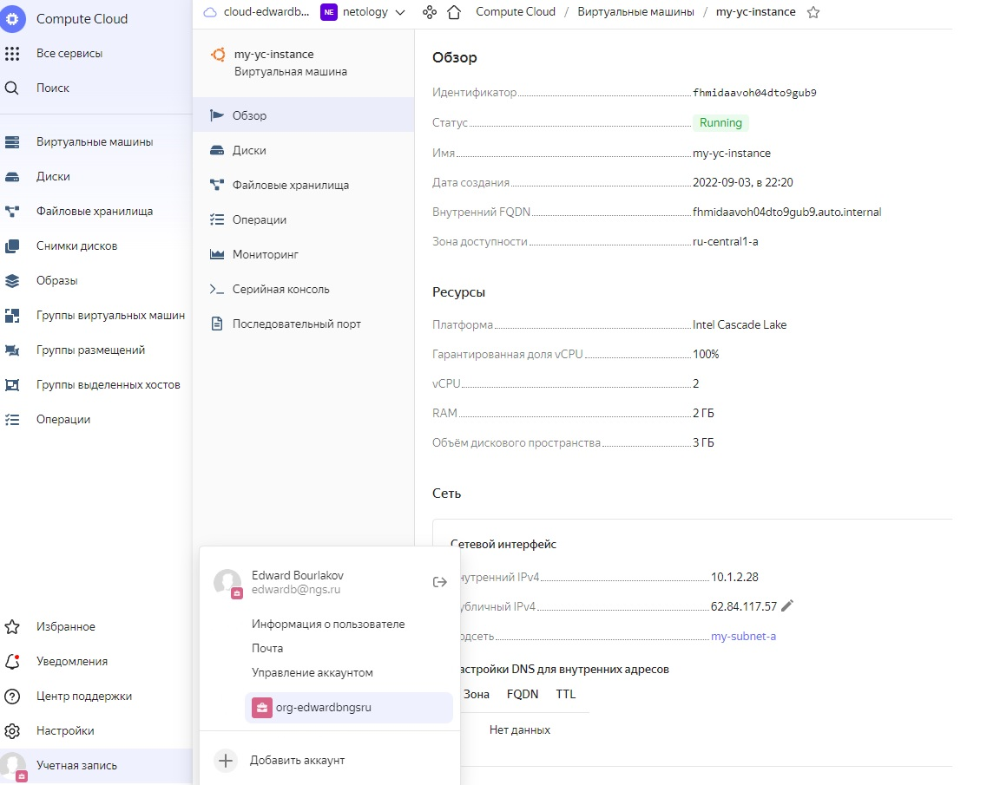

### Домашнее задание к занятию "5.4. Оркестрация группой Docker контейнеров на примере Docker Compose"

---
### Задача 1
Создать собственный образ операционной системы с помощью Packer.
Для получения зачета, вам необходимо предоставить:
Скриншот страницы, как на слайде из презентации (слайд 37).

---
### Ответ:

      1) Проверяем версию packer
           root@docker:/home/bes#  packer --version
           1.7.7
           root@docker:/home/bes#
      2) Устанвлаиваем на Ubuntu  утилиту yc

       root@docker:/home/bes#  curl -sSL https://storage.yandexcloud.net/yandexcloud-yc/install.sh | bash
       install.sh | bash
       Downloading yc 0.95.0
         % Total    % Received % Xferd  Average Speed   Time    Time     Time  Current
                                        Dload  Upload   Total   Spent    Left  Speed
       100 89.5M  100 89.5M    0     0  31.1M      0  0:00:02  0:00:02 --:--:-- 31.1M
       Yandex Cloud CLI 0.95.0 linux/amd64
    
       yc PATH has been added to your '/root/.bashrc' profile
       yc bash completion has been added to your '/root/.bashrc' profile.
       Now we have zsh completion. Type "echo 'source /root/yandex-cloud/completion.zsh.inc' >> 
       ~/.zshrc" to install itTo complete installation, start a new shell (exec -l $SHELL) or type 'source "/root/.bashrc"' in the current one

      3) Переезапускаем сессию для перезапуска bash и обновления его переменных окружения
      4) Получаем по ссылке  OAuth токен 
       <https://oauth.yandex.ru/verification_code#access_token=y0_AgAEA7qjbCX2AATuwQAAAADNx-_dP9L62XaATFq3ZDEjDT3hOpl-fwo&token_type=bearer&expires_in=31536000>
       OAuth токен:  y0_AgAEA7qjbCX2AATuwQAAAADNx-_dP9L62XaATFq3ZDEjDT3hOpl-fwo
     
      5) Запускаем yc init   втавляем полученный OAuth токен. Выбираем вариант 2 - создать новый профиль b default compute zone

            Please enter OAuth token: y0_AgAEA7qjbCX2AATuwQAAAADNx-_dP9L62XaATFq3ZDEjDT3hOpl-fwo
            You have one cloud available: 'cloud-edwardbngsru' (id = b1g3dtd6rmc18p0kufbd). It is going to be used by default.
            Please choose folder to use:
             [1] default (id = b1gnnc3gmk34cq7uta5r)
             [2] netology (id = b1gks5lsfvt1r1gh37ib)
             [3] Create a new folder
            Please enter your numeric choice: 2
            Your current folder has been set to 'netology' (id = b1gks5lsfvt1r1gh37ib).
            Do you want to configure a default Compute zone? [Y/n] Y
            Which zone do you want to use as a profile default?
             [1] ru-central1-a
             [2] ru-central1-b
             [3] ru-central1-c
             [4] Don't set default zone
            Please enter your numeric choice: 1
            Your profile default Compute zone has been set to 'ru-central1-a'.

     6) Инициализируем профиль
            root@docker:/home/bes# yc config list
            token: y0_AgAEA7qjbCX2AATuwQAAAADNx-_dP9L62XaATFq3ZDEjDT3hOpl-fwo
            cloud-id: b1g3dtd6rmc18p0kufbd
            folder-id: b1gks5lsfvt1r1gh37ib
            compute-default-zone: ru-central1-a

            root@docker:/home/bes# yc compute image list
            +----+------+--------+-------------+--------+
            | ID | NAME | FAMILY | PRODUCT IDS | STATUS |
            +----+------+--------+-------------+--------+
            +----+------+--------+-------------+--------+

     7)  Инициализируем сети

            root@docker:/home/bes# yc vpc network create --name net --labels my-label=netology --description "my first network via yc"
            id: enpgj3k47ptuspj30p2b
            folder_id: b1gks5lsfvt1r1gh37ib
            created_at: "2022-09-02T13:33:45Z"
            name: net
            description: my first network via yc
            labels:
              my-label: netology

    8)  Инициализруем  подсеть 10.1.2.0/24 

            root@docker:/home/bes# yc vpc subnet create --name my-subnet-a --zone ru-central1-a  --range 10.1.2.0/24 --network-name net --description "my first subnet via yc"                id: e9b1j9kfc6tkabakden7
            folder_id: b1gks5lsfvt1r1gh37ib
            created_at: "2022-09-02T13:35:30Z"
            name: my-subnet-a
            description: my first subnet via yc
            network_id: enpgj3k47ptuspj30p2b  
            zone_id: ru-central1-a
            v4_cidr_blocks:
            - 10.1.2.0/24

            Получаем подсеть e9b1j9kfc6tkabakden7. Добавляем ее в созданный файл  centos-7-base.json

    9) Устанавливаем из файлов выше folder_id  и network_id в созданный файл centos-7-base.json .

        root@docker:/home/bes# cat  centos-7-base.json
            {
              "builders": [
                {
                  "disk_type": "network-nvme",
                  "folder_id": "b1gks5lsfvt1r1gh37ib",
                  "image_description": "by packer",
                  "image_family": "centos",
                  "image_name": "centos-7-base",
                  "source_image_family": "centos-7",
                  "ssh_username": "centos",
                  "subnet_id": "e9b1j9kfc6tkabakden7",   
                  "token": "y0_AgAEA7qjbCX2AATuwQAAAADNx-_dP9L62XaATFq3ZDEjDT3hOpl-fwo",
                  "type": "yandex",
                  "use_ipv4_nat": true,
                  "zone": "ru-central1-a"
                }
              ],
              "provisioners": [
                {
                  "inline": [
                    "sudo yum -y update",
                    "sudo yum -y install bridge-utils bind-utils iptables curl net-tools tcpdump rsync telnet openssh-server"
                  ],
                  "type": "shell"
                }
              ]
            }
        

   10) Проводим валидацию файла
          
           root@docker:/home/bes# packer validate centos-7-base.json
           The configuration is valid.
           root@docker:/home/bes#
   
   11) Запускаем создание образа виртуальной машины, совместимого с YC   с помощью packer /
           
              root@docker:/home/bes# packer build  centos-7-base.json
           
              yandex: output will be in this color.

              ==> yandex: Creating temporary ssh key for instance...
              ==> yandex: Using as source image: fd88d14a6790do254kj7 (name: "centos-7-v20220620", family: "centos-7")
              ==> yandex: Use provided subnet id e9b1j9kfc6tkabakden7
              ... 
              ==> Builds finished. The artifacts of successful builds are:
              --> yandex: A disk image was created: centos-7-base (id: fd8ugrlfp5paoq5ogdsr) with family name centos

              root@docker:/home/bes# yc compute image list
              +----------------------+---------------+--------+----------------------+--------+
              |          ID          |     NAME      | FAMILY |     PRODUCT IDS      | STATUS |
              +----------------------+---------------+--------+----------------------+--------+
              | fd8ugrlfp5paoq5ogdsr | centos-7-base | centos | f2euv1kekdgvc0jrpaet | READY  |
              +----------------------+---------------+--------+----------------------+--------+

      

   
   12) Сначала установим Terraform на terraform --versionUbuntu
      
            root@docker:~#  sudo apt-get update && sudo apt-get install -y gnupg software-properties-common curl  
            root@docker:~#  curl -fsSL https://apt.releases.hashicorp.com/gpg | sudo apt-key add -
            root@docker:~#  sudo apt-add-repository "deb [arch=amd64] https://apt.releases.hashicorp.com $(lsb_release -cs) main"
            root@docker:~#  sudo apt-get update && sudo apt-get install terraform

            root@docker:/etc# terraform --version
            Terraform v1.2.8
            on linux_amd64
            root@docker:/etc#

   13) Копируем на Ubuntu папку с файлами конфигурации terraform
          C:\Windows\System32\OpenSSH> scp -r C:\Users\bes\PycharmProjects\Netology_Lessons\vagrant\LESSON_5.4\src\ansible  bes@192.168.1.16:/home/bes

   14) Добавляем в файл variables.cf  параметры из конфиг-листа ниже 
          root@docker:~/terraform# yc config list
          token: y0_AgAEA7qjbCX2AATuwQAAAADNx-_dP9L62XaATFq3ZDEjDT3hOpl-fwo
          cloud-id: b1g3dtd6rmc18p0kufbd
          folder-id: b1gks5lsfvt1r1gh37ib
          compute-default-zone: ru-central1-a

   15) Инициализируем бэкэнд terraform, связав его с YC c помощью файла provider.tf 
       Создается файл terraform.lock.icl  

   16) Запускаем проверку плана Terraform
       Выполняем  последовательно  terraform init , terraform validate , terraform plan
       Когда применяем Terraform план -  соглашаемся - "yes"
       root@docker:~/terraform# terraform plan

       Успешный результат: Plan: 3 to add, 0 to change, 0 to destroy.

       Changes to Outputs:
       + external_ip_address_node01_yandex_cloud = (known after apply)
       + internal_ip_address_node01_yandex_cloud = (known after apply)

   17) Удаляем сеть и подсеть, совпадающую с  планируемой в фалах конфигурации.

   18) Создаем виртуальную сеть, подсеть и машину с помощью terraform. 
       root@docker:~/terraform# terraform apply

       Результат :
       Outputs:

       external_ip_address_node01_yandex_cloud = "84.201.158.119"
       internal_ip_address_node01_yandex_cloud = "192.168.101.19"

   19) В свойствах созданной виртуалки разрешаем доступ к SSH-консоли 

  

   20) Правим файл provision.yaml для ansible
       
       docker1.netology ansible_host=84.201.158.119  ansible_port=22

   21) Запускаем  ansible=plaubook provision.yaml

  

---
### Задача 2
Создать вашу первую виртуальную машину в Яндекс.Облаке.
Для получения зачета, вам необходимо предоставить:config 
Скриншот страницы свойств созданной ВМ, как на примере ниже:

---
### Ответ ::

   1) Для тестовых целей создаем  виртуальную машину, предварительно сгенерив ключи с помощью ssh-keygen 
   
            root@docker:/home/bes#  ssh-keygen 
            root@docker:/home/bes#  yc compute instance create --name my-yc-instance --network-interface subnet-name=my-subnet-a,  
            \  nat-ip-version=ipv4 --zone ru-central1-a  --ssh-key ~/.ssh/id_rsa.pub

   Результат: 

  <https://github.com/edward-burlakov/vagrant/blob/main/LESSON_5.4/my-yc-instance.png>

  

  2) Удаляем ее

            root@docker:/home/bes#  yc compute instance delete my-yc-instance

---
### Задача 3
        Создать ваш первый готовый к боевой эксплуатации компонент мониторинга, состоящий из стека микросервисов.
        Для получения зачета, вам необходимо предоставить:
        Скриншот работающего веб-интерфейса Grafana с текущими метриками, как на примере ниже

---
### Ответ:

---
#### Задача 4 (*)
    Создать вторую ВМ и подключить её к мониторингу развёрнутому на первом сервере.
    Для получения зачета, вам необходимо предоставить:
    Скриншот из Grafana, на котором будут отображаться метрики добавленного вами сервера.