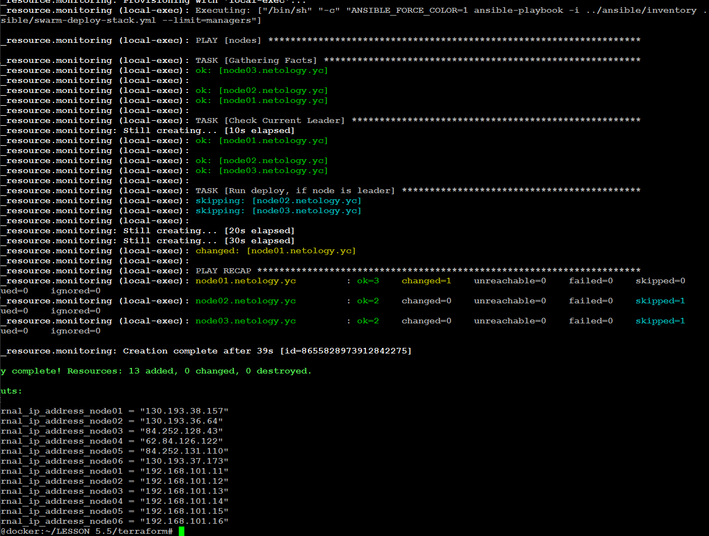
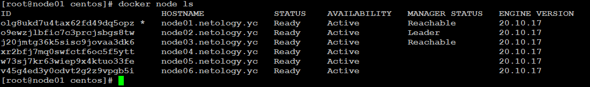
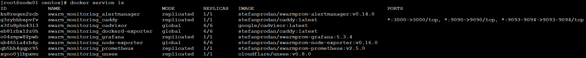
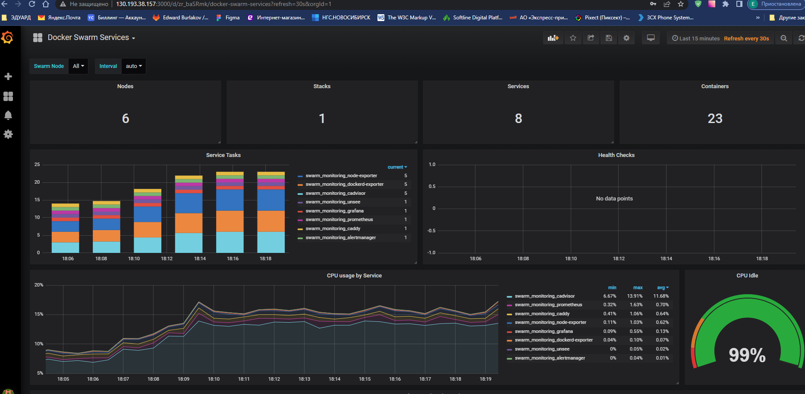
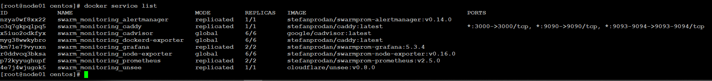

## Домашнее задание к занятию "5.5. Оркестрация кластером Docker контейнеров на примере Docker Swarm"
----

### Задача 1

Дайте письменные ответы на следующие вопросы:

---
#### 1) В чём отличие режимов работы сервисов в Docker Swarm кластере: replication и global?

#### Ответ:
----
1) Режим работы сервисов replication  предполагает что, количество запущенных экземпляров данного сервиса
    не превысит числа, заданного в docker-compose.yml  - файле конфигурации сервисов  SWARM-кластера.
2) Режим работы сервисов global предполагает, что на каждой запускаемой ноде кластера будет обязательно развернут один экземпляр данного сервиса.
   Пример такого сервиса - агент мониторинга nodeexporter. 

---
####  2) Какой алгоритм выбора лидера используется в Docker Swarm кластере?

#### Ответ:
----
 При создании кластера  (команда "docker swarm init")  роль  leader выдается  самой первой созданной ноде, которая стартует в режиме manager.
 При инциденте выбывания из строя ноды с ролью leader, данная  роль  назначается одной из других  активных нод,  работающих в режиме manager
 на основании механизма RAFT.

---
####  3) Что такое Overlay Network?

#### Ответ:
----
Сетевой overlay-драйвер создает распределенную шифрованную сеть между несколькими контейнерами, создаваемыми демоном Docker. 
Overlay-сеть использует технологию vxlan, которая инкапсулирует layer 2 фреймы в layer 4 пакеты (UDP/IP).
Эта  сеть находится поверх сети, основанной на  работе по протоколу TCP/IP, позволяя общаться контейнерам, 
подключенным к ней (включая контейнеры служб SWARM-кластера). 

Любые точки, которые являются частью этой виртуальной сети, выглядят друг для друга так, 
будто они связаны  через коммутатор и не заботятся об устройстве основной физической сети.
Docker прозрачно обрабатывает маршрутизацию каждого пакета от и к соответствующему хосту демона Docker 
и соответствующему контейнеру назначения.

Если инициализируете SWARM кластер или  к нему  присоединяете хост Docker,- на этом хосте Docker создаются две новые сети
(смотрим через docker network ls):
1) оверлейная сеть под названием ingress, которая обрабатывает трафик управления и данных, связанный со службами кластера.
   Сеть ingress нужна только для того, чтобы устанавливать входящие соединения с контейнерами из внешнего мира.
   Также именно в ней происходит балансировка нагрузки, которую предоставляет swarm-кластер.
   Когда создается swarm-сервис и явно не подключается к определяемой пользователем оверлейной сети, он подключается к ingress сети по умолчанию.
   

2) Docker создает bridge-интерфейс для каждой overlay-сети, который соединяет виртуальные туннельные интерфейсы, 
    выполняющие vxlan туннельную связь между хостами.
    Таким образом, сеть docker_bridge соединяет каждую ноду кластера SWARM с другими нодами, участвующими в кластере SWARM.
    Создается на КАЖДОЙ ноде swarm-кластера. 

----
### Задача 2

Создать ваш первый Docker Swarm кластер в Яндекс.Облаке
Для получения зачета, вам необходимо предоставить скриншот из терминала (консоли), с выводом команды:
docker node ls

---
### Ответ:
---

1) Выполняем все как описано в Задачах 1 и 2 в предыдущем уроке LESSON_5.4.
   На последнем шаге создаём виртуальную сеть, подсеть и машину с помощью terraform. 

        root@docker:~/terraform# terraform apply
        ...
        Outputs:
    
        external_ip_address_node01 = "130.193.38.157"
        external_ip_address_node02 = "130.193.36.64"
        external_ip_address_node03 = "84.252.128.43"
        external_ip_address_node04 = "62.84.126.122"
        external_ip_address_node05 = "84.252.131.110"
        external_ip_address_node06 = "130.193.37.173"
        internal_ip_address_node01 = "192.168.101.11"
        internal_ip_address_node02 = "192.168.101.12"
        internal_ip_address_node03 = "192.168.101.13"
        internal_ip_address_node04 = "192.168.101.14"
        internal_ip_address_node05 = "192.168.101.15"
        internal_ip_address_node06 = "192.168.101.16"

Результат :

3) Подключаемся к первой ноде развернутого кластера
  
        root@docker:~/terraform#  ssh -A   centos@130.193.38.157
        
        root@docker:~/LESSON_5.5/terraform# ssh -A centos@130.193.38.157
        
       [centos@node01 ~]$

4) Входим в сессию root и смотрим статус нод кластера
     
      [centos@node01 ~]$ sudo -s
      [root@node01 centos]#  docker node ls

5) Результат :

----
###  Задача 3

Создать ваш первый, готовый к боевой эксплуатации кластер мониторинга, состоящий из стека микросервисов.
Для получения зачета, вам необходимо предоставить скриншот из терминала (консоли), с выводом команды:
docker service ls

---
### Ответ:

Если количество реплик на каждый сервис не впечатляет - то надо 
1) Отредактировать файл docker-compose.yml .
2) Пересоздать SWARM-кластер.

Входим на одну из manager- нод и получаем новый результат.

      [centos@node01 ~]$ sudo -s
      [root@node01 centos]#  docker service ls

----
### Задача 4 (*)

Выполнить на лидере Docker Swarm кластера команду (указанную ниже) и дать письменное описание её функционала, что она делает и зачем она нужна:
** см.документацию: https://docs.docker.com/engine/swarm/swarm_manager_locking/ **

---
### Ответ:

      docker swarm update --autolock=true   -  Включение функции  Autolock в уже существующем Docker Swarm .
                                               После перезапуска SWARM-кластера для доступа к manager потребуется указать ключ шифрования.
      
      
      docker swarm update --autolock=false  - Чтобы выключить автоблокировку  после перезапуска существующего SWARM-кластера, установите autolock флаг в false .
      
      docker swarm unlock   -  Разблокирует заблокированный менеджер с помощью предоставленного пользователем ключа разблокировки. 
                               Эта команда должна использоваться для повторной активации диспетчера после перезапуска его демона Docker, 
                               если параметр autolock был включен  
      
      Ключ разблокировки печатается в момент включения автоблокировки, 
                               а также доступен с помощью ввода команды # docker swarm unlock-key команды.