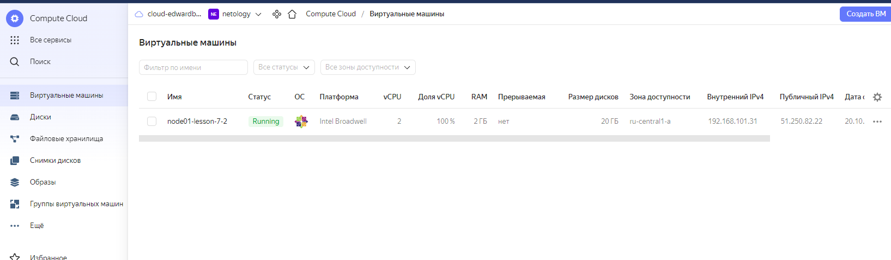
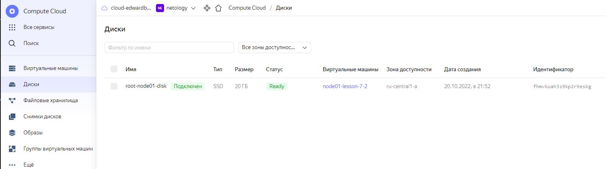
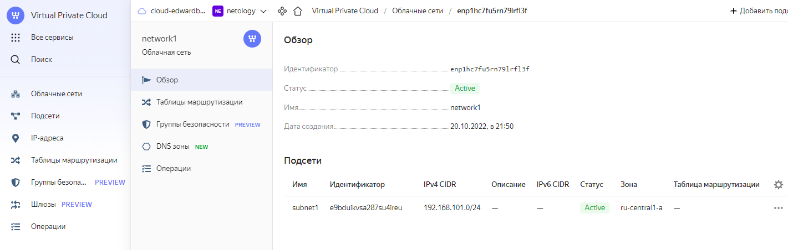

## Домашнее задание к занятию "7.2. Облачные провайдеры и синтаксис Terraform."

Зачастую разбираться в новых инструментах гораздо интересней понимая то, как они работают изнутри. 
Поэтому в рамках первого необязательного задания предлагается завести 
свою учетную запись в AWS (Amazon Web Services) или Yandex.Cloud. 
Идеально будет познакомиться с обоими облаками, потому что они отличаются.

---
### Задача 1 

#### Вариант с AWS. 
Регистрация в aws и знакомство с основами (необязательно, но крайне желательно).

[https://aws.amazon.com/ru/free/?all-free-tier.sort-by=item.additionalFields.SortRank&all-free-tier.sort-order=asc&awsf.Free%20Tier%20Types=*all&awsf.Free%20Tier%20Categories=*all]

Остальные задания можно будет выполнять и без этого аккаунта, но с ним можно будет увидеть полный цикл процессов.

AWS предоставляет достаточно много бесплатных ресурсов в первый год после регистрации, подробно описано здесь.

Создайте аккаут aws.
Установите c aws-cli 
[https://aws.amazon.com/cli/ ]
Выполните первичную настройку aws-sli 
https://docs.aws.amazon.com/cli/latest/userguide/cli-configure-quickstart.html.
Создайте IAM политику для терраформа c правами
AmazonEC2FullAccess
AmazonS3FullAccess
AmazonDynamoDBFullAccess
AmazonRDSFullAccess
CloudWatchFullAccess
IAMFullAccess
Добавьте переменные окружения
export AWS_ACCESS_KEY_ID=(your access key id)
export AWS_SECRET_ACCESS_KEY=(your secret access key)
Создайте, остановите и удалите ec2 инстанс (любой с пометкой free tier) через веб интерфейс.
В виде результата задания приложите вывод команды aws configure list.

#### Вариант с Yandex.Cloud. 

Регистрация в ЯО и знакомство с основами (необязательно, но крайне желательно).
Подробная инструкция на русском языке содержится здесь - 
[https://cloud.yandex.ru/docs/tutorials/infrastructure-management/terraform-quickstart]
- Обратите внимание на период бесплатного использования после регистрации аккаунта.
- Используйте раздел "Подготовьте облако к работе" для регистрации аккаунта. 
- Далее раздел "Настройте провайдер" для подготовки базового терраформ конфига.
- Воспользуйтесь инструкцией на сайте терраформа, что бы не указывать авторизационный токен в коде, 
  а терраформ провайдер брал его из переменных окружений.

---
###  Ответ: 

1) Сначала установим Terraform на Ubuntu
      
         root@docker:~#  sudo apt-get update && sudo apt-get install -y gnupg software-properties-common curl  
         root@docker:~#  curl -fsSL https://apt.releases.hashicorp.com/gpg | sudo apt-key add -
         root@docker:~#  sudo apt-add-repository "deb [arch=amd64] https://apt.releases.hashicorp.com $(lsb_release -cs) main"
         root@docker:~#  sudo apt-get update && sudo apt-get install terraform

         root@docker:/etc# terraform version
         Terraform v1.3.2
         on linux_amd64
         root@docker:/etc#

2) Cоздаём новый сервисный эккаунт по руководству https://cloud.yandex.ru/docs/iam/operations/sa/create 
   
         root@docker:~/LESSON_7.2# yc iam service-account create --name my-robot
         id: ajek2ne5khrks2n72on7
         folder_id: b1gks5lsfvt1r1gh37ib
         created_at: "2022-09-04T10:02:15.480498083Z"
         name: my-robot
      
         root@docker:~/LESSON_7.2# yc iam service-account --folder-id b1gks5lsfvt1r1gh37ib list
         +----------------------+----------+
         |          ID          |   NAME   |
         +----------------------+----------+
         | ajek2ne5khrks2n72on7 | my-robot |
         +----------------------+----------+

3) Создаём FolderID (профиль CLI) для выполнения операций от имени сервисного аккаунта. Указываем имя FolderID:

        root@docker:~/LESSON_7.2#  yc config profile create netology
        Результат:

        Profile 'netology' created and activated

4) Назначаем роль editor сервисному эккаунту для выбранной Folder ID

        root@docker:~/LESSON_7.2# yc resource-manager folder add-access-binding b1gks5lsfvt1r1gh37ib --role editor \
        --subject serviceAccount:ajek2ne5khrks2n72on7
        done (1s)

5) Создаем первичный  авторизованный ключ для сервисного аккаунта my-robot  и запишем его в файл  key.json 
   для доступа terraform под сервисным эккаунтом my-robot в YC

        root@docker:~/LESSON_7.2#  yc iam key create --service-account-id ajek2ne5khrks2n72on7 --output key.json
        id: ajee9lqmtl98k4jbavsg
        service_account_id: ajek2ne5khrks2n72on7
        created_at: "2022-10-19T15:45:46.221673134Z"
        key_algorithm: RSA_2048

6) Добавляем  в файл конфигурации /root/terraform/variables.cf  параметры из конфиг-листа ниже

        root@docker:~/LESSON_7.2# yc config list
        token: y0_AgAEA7qjbCX2AATuwQAAAADNx-_dP9L62XaATFq3ZDEjDT3hOpl-...
        cloud-id: b1g3dtd6rmc18p0kufbd
        folder-id: b1gks5lsfvt1r1gh37ib
        compute-default-zone: ru-central1-a

7) Генерируем новый Ключ Доступа (IAM) для эккаунта my-robot

        root@docker:~/LESSON_7.2#   yc iam access-key create --service-account-name my-robot --description "this key is for Lesson 7.2"

8) Проверяем список ключей авторизации для экканута my-robot

          root@docker:~/LESSON_7.2#   yc iam access-key list --service-account-name my-robot

          +----------------------+----------------------+---------------------------+
          |          ID          |  SERVICE ACCOUNT ID  |          KEY ID           |
          +----------------------+----------------------+---------------------------+
          | ajekm53aops709pmvhce | ajek2ne5khrks2n72on7 | YCAJEQrdiDPW5PSO37M7MuUw0 |
          +----------------------+----------------------+---------------------------+

9) Задаём конфигурацию профиля:
 
        root@docker:~/LESSON_7.2#   yc config set service-account-key key.json
        root@docker:~/LESSON_7.2#   yc config set cloud-id b1g3dtd6rmc18p0kufbd
        root@docker:~/LESSON_7.2#   yc config set folder-id b1gks5lsfvt1r1gh37ib

        Где:

        service-account-key — файл с авторизованным ключом сервисного аккаунта.
        cloud-id — идентификатор облака.
        folder-id — идентификатор каталога (профиля netology).

10) Добавляем аутентификационные данные в переменные окружения:

        root@docker:~/LESSON_7.2#  export YC_TOKEN=$(yc iam create-token)
        root@docker:~/LESSON_7.2#  export YC_CLOUD_ID=$(yc config get cloud-id)
        root@docker:~/LESSON_7.2#  export YC_FOLDER_ID=$(yc config get folder-id)

        Где:

        YC_TOKEN — IAM-токен.
        YC_CLOUD_ID — идентификатор облака.
        YC_FOLDER_ID — идентификатор каталога.

---
### Задача 2. Создание aws ec2 или yandex_compute_instance через терраформ.

1) В каталоге terraform вашего основного репозитория, который был создан в начале курса, создайте файл main.tf и versions.tf.
2) Зарегистрируйте провайдер 
      1) для aws
         - В файл main.tf добавьте блок provider,а в versions.tf блок terraform с вложенным блоком required_providers. 
         - Укажите любой выбранный вами регион внутри блока provider.
     2)  Либо для yandex.cloud.
     [ https://registry.terraform.io/providers/yandex-cloud/yandex/latest/docs ]

     Подробную инструкцию можно найти здесь.
     [ https://cloud.yandex.ru/docs/solutions/infrastructure-management/terraform-quickstart ]

     Внимание! В гит репозиторий нельзя пушить ваши личные ключи доступа к аккаунту. 
     Поэтому в предыдущем задании мы указывали их в виде переменных окружения.

3) В файле main.tf воспользуйтесь блоком data "aws_ami для поиска ami образа последнего Ubuntu.
4) В файле main.tf создайте ресурс  
      - либо если AWS,  создаем ec2 instance.
        [https://registry.terraform.io/providers/hashicorp/aws/latest/docs/resources/instance]
        Постарайтесь указать как можно больше параметров для его определения. Минимальный набор параметров 
        указан в первом блоке Example Usage, но желательно, указать большее количество параметров.
   
      -либо в YC  объект ** yandex_compute_image.** 
        [https://registry.terraform.io/providers/yandex-cloud/yandex/latest/docs/resources/compute_image]
   
5) Также в случае использования aws:
    Добавьте data-блоки aws_caller_identity и aws_region.
    В файл outputs.tf поместить блоки output с данными об используемых в данный момент:
   - AWS account ID,
   - AWS user ID,
   - AWS регион, который используется в данный момент,
   - Приватный IP ec2 инстансы,
   - Идентификатор подсети в которой создан инстанс.
   
6) Если вы выполнили первый пункт, то добейтесь того, что бы команда terraform plan выполнялась без ошибок.

В качестве результата задания предоставьте:
Ответ на вопрос: при помощи какого инструмента (из разобранных на прошлом занятии) можно создать свой образ ami?

Ссылку на репозиторий с исходной конфигурацией терраформа.

---
### Ответ :

####  1) Hashicorp Packer

####  2) Ссылка на репозиторий с исходной конфигурацией терраформа  для развертывания инстанса 
[https://github.com/edward-burlakov/vagrant/tree/main/LESSON_7.2]
 
### Шаги

1) Настраиваем  провайдера , для этого

  - Либо поднимаем VPN-соединение для возможности скачать plugin-конфигурацию провайдера  с репозитория Hashicorp

           root@docker:~/   cd /root/vpnbook && openvpn --config vpnbook-fr1-udp53.ovpn
           Username: vpnbook
           Password: 79c8xza
 
  - Либо настраиваем репозиторий Yandex как основной , добавив следующий блок в  ~/.terraformrc :

           root@docker:~/LESSON_7.2# nano ~/.terraformrc            
            
           provider_installation {
             network_mirror {
               url = "https://terraform-mirror.yandexcloud.net/"
               include = ["registry.terraform.io/*/*"]
             }
             direct {
               exclude = ["registry.terraform.io/*/*"]
             }
           }

2) Инициализируем бэкэнд terraform, связав его с YC c помощью файла provider.tf  - Создаем файл terraform.lock.hcl  
      
        root@docker:~/LESSON_7.2# terraform init
        Initializing the backend...

        Initializing provider plugins...
        - Finding latest version of yandex-cloud/yandex...
        - Installing yandex-cloud/yandex v0.80.0...
        - Installed yandex-cloud/yandex v0.80.0 (self-signed, key ID E40F590B50BB8E40)

3) Получаем  список доступных  июньских образов в облачном репозитории YC

        root@docker:~/LESSON_7.2# yc compute image list --folder-id standard-images | grep centos-7-v202206
        | fd80rnhvc47031anomed | centos-7-v20220613  | centos-7    | f2ed6g56rfbepn59jt09       | READY  |
        | fd88d14a6790do254kj7 | centos-7-v20220620  | centos-7    | f2euv1kekdgvc0jrpaet       | READY  |
        | fd8ad4ie6nhfeln6bsof | centos-7-v20220606  | centos-7    | f2egp3k2jkoqh7dl2t0l       | READY  |
   
        Добавляем ссылку на свежий образ fd88d14a6790do254kj7  в файл конфигурации  variables.tf  

4) Запускаем проверку плана Terraform и  форматирование файлов конфигурации

        Выполняем  последовательно   terraform validate , terraform fmt terraform plan
        Когда применяем Terraform план -  соглашаемся - "yes"
        root@docker:~/LESSON_7.2# terraform plan
 
       
        Plan: 1 to add, 0 to change, 1 to destroy.

        Changes to Outputs:
        + external_ip_address_node01_yandex_cloud = (known after apply)
        + internal_ip_address_node01_yandex_cloud = (known after apply)

5) Создаем виртуальную сеть, подсеть и сам инстанс  с помощью terraform apply. 

        root@docker:~/LESSON_7.2# terraform apply
        yandex_vpc_network.default: Refreshing state... [id=enppf11bp3tek2o9vqf9]
        yandex_vpc_subnet.default: Refreshing state... [id=e9bv5bnnkdt4ltsnq5f6]

        Terraform used the selected providers to generate the following execution plan. Resource actions are indicated with the following symbols:
        + create

        Terraform will perform the following actions:

        # yandex_compute_instance.node01 will be created
        + resource "yandex_compute_instance" "node01" {
        ...
        ...
        ...
        Do you want to perform these actions?
        Terraform will perform the actions described above.
        Only 'yes' will be accepted to approve.
        Enter a value: yes
        
        yandex_compute_instance.node01: Creating...
        yandex_compute_instance.node01: Still creating... [10s elapsed]
        yandex_compute_instance.node01: Still creating... [20s elapsed]
        yandex_compute_instance.node01: Still creating... [30s elapsed]
        yandex_compute_instance.node01: Creation complete after 33s [id=fhm728hm7g9ihpi4uvkd]
        
        Apply complete! Resources: 1 added, 0 changed, 0 destroyed.

        Outputs:
        
       external_ip_address_node01_yandex_cloud = "51.250.82.22"
       internal_ip_address_node01_yandex_cloud = "192.168.101.31"

---

---

---
